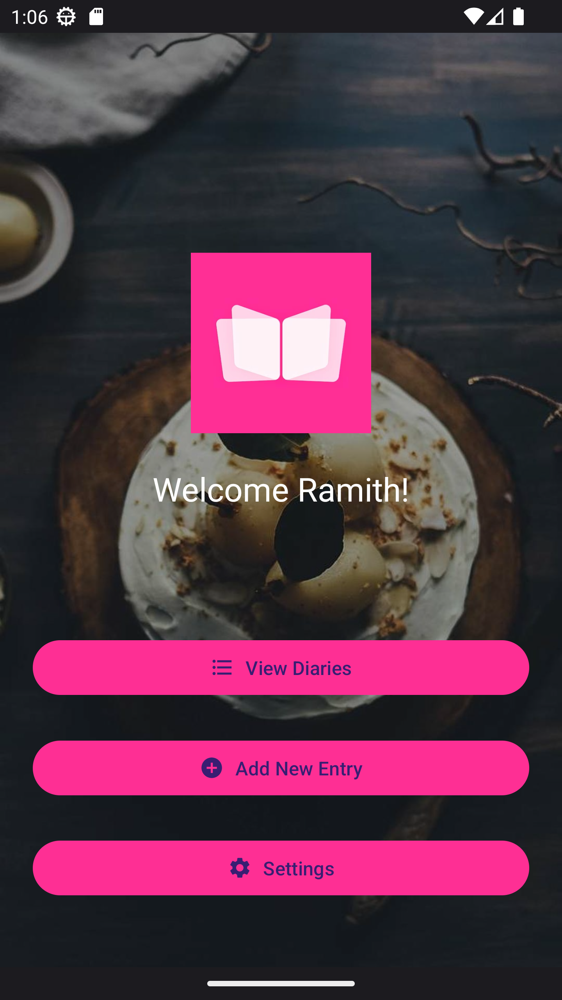
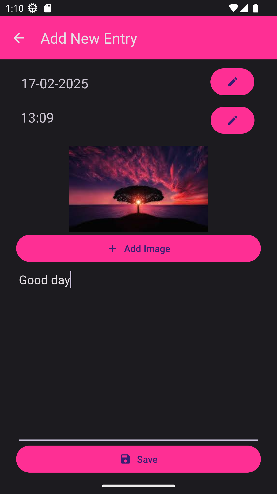
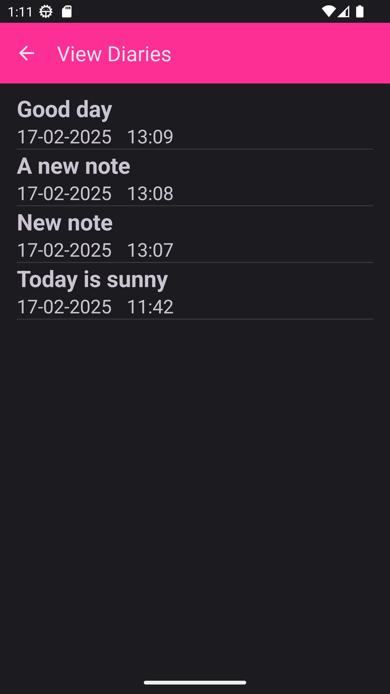

# Dairy App

Dairy App is an Android application that allows users to create, view, and manage diary entries. Users can add text entries, attach images, and view their diary entries in a list format.

## Features

- Add new diary entries with text and images
- View a list of diary entries
- Edit and delete existing diary entries
- Save user settings
- Dynamic background image on the main screen

## Screenshots
<p>



</p>

## Installation

1. Clone the repository:
    ```sh
    git clone https://github.com/Ramith-Gunawardana/DairyApp.git
    ```
2. Open the project in Android Studio.
3. Build and run the project on an Android device or emulator.

## Usage

1. Launch the app on your Android device.
2. Use the "Add New Entry" button to create a new diary entry.
3. View your diary entries by clicking the "View Diaries" button.
4. Edit or delete entries by selecting them from the list.
5. Change user settings by clicking the "Settings" button.

## Dependencies

- [Glide](https://github.com/bumptech/glide) for image loading
- [Picasso](https://square.github.io/picasso/) for image loading
- [OkHttp](https://square.github.io/okhttp/) for network requests
- AndroidX libraries for UI components and compatibility

## Contributing

Contributions are welcome! Please fork the repository and create a pull request with your changes.

## License

This project is licensed under the MIT License. See the [LICENSE](LICENSE) file for details.
